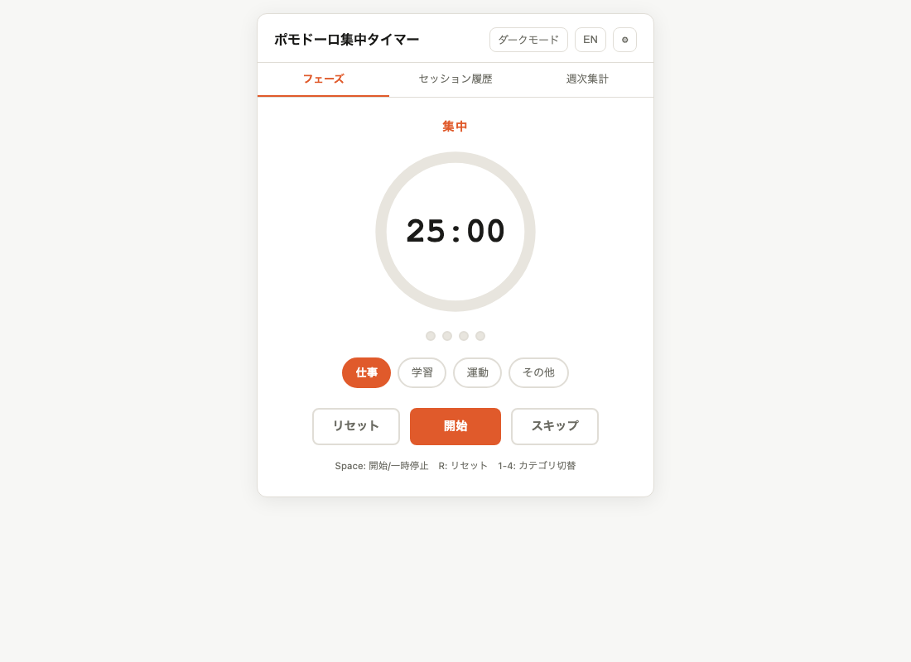

# Pomodoro Focus

[](https://sen.ltd/portfolio/pomodoro-focus/)

ポモドーロタイマー + 集中度ログ。カテゴリ別の時間集計、週次レポート付き。

**Live demo**: https://sen.ltd/portfolio/pomodoro-focus/



## 特徴

- 25/5/15 min timer (configurable)
- 4-cycle tracking with long breaks
- Category labels (Work, Study, Exercise, Other)
- Session log with localStorage persistence
- Weekly stats view with CSS-only bar charts
- Web Notification + Audio alert (Web Audio API)
- Keyboard shortcuts (Space, R, 1-4)
- Japanese / English UI, dark/light theme
- Zero dependencies, no build step

## ローカル起動

```sh
npm run serve
```

ブラウザで http://localhost:8080 を開く。

## テスト

```sh
npm test
```

Node.js 18+ の組み込みテストランナーを使用。ビルドツール不要。

## キーボード操作

| キー | 動作 |
|------|------|
| Space | 開始 / 一時停止 |
| R | リセット |
| 1 | カテゴリ: Work |
| 2 | カテゴリ: Study |
| 3 | カテゴリ: Exercise |
| 4 | カテゴリ: Other |

## ファイル構成

```
index.html       # Single-page app
style.css        # Design tokens, dark/light theme
src/
  pomodoro.js    # Pure logic (timer state, session management, stats)
  i18n.js        # ja/en translations
  main.js        # DOM, events, rendering, timer loop
tests/
  pomodoro.test.js  # 15+ unit tests
```

## ライセンス

MIT. See [LICENSE](./LICENSE).
